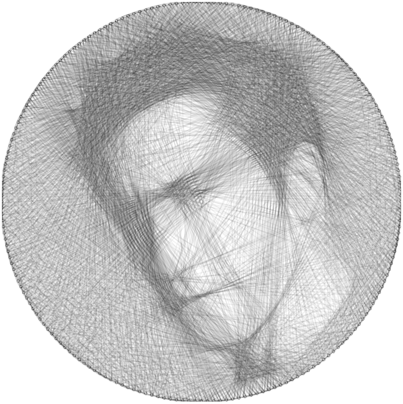

## Recreate Images with String!



This was a personal project of mine in early 2024.

### How to run

Create a python virual environment, activate, and install requirements:

```bash
python3 -m venv .venv
source .venv/bin/activate
python -m pip install -r requirements.txt
export PYTHONPATH=$PYTHONPATH:$(abspath ./src)
```

Find an image you want to stringify! I recommend a square photo with a centered face, with lighthing that provides contrast to facial features. Also, a background that is uniform and mid-brightness will help. I have supplied an example photo of actor Jake Gyllenhaal `./images/jake.png`.

**Step 1:** generate a mask. The reason this step is separate is because it is an expensive operation. I suggest running the command with the following parameters:

```bash
python -m stringarg.gen_mask -y 100 -x 100 -n 200 -d 0.01 -f 0.2
```

This will generate a file `./src/masks/mask_h=100_w=100_numnails=200_nailfrac=0.2_maxdist=0.01.npy`.

**Step 2:** generate your string sequence by running the following command:

```bash
python -m stringarg.gen_mask -i jake.png -y 100 -x 100 -n 200 -d 0.01 -f 0.2
```

This will generate several files `./cycle_*.json`. The final result is saved to `./cycle_final.json`. I have included in this repository the final result of the above example commands.

### Visualizing the result

Start a Jupyter Notebook, then open and run the `notebooks/StringArt.ipynb` notebook:

```bash
jupyter notebook
```

After interacting with the icanvas slider, you should see a result similar to the image above.